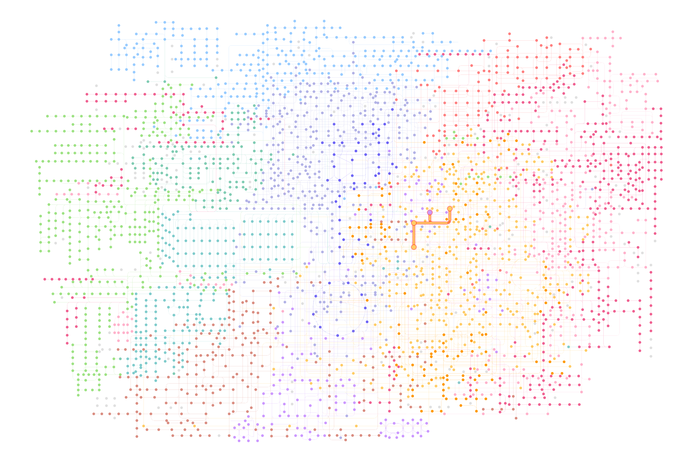

<!-- README.md is generated from README.Rmd. Please edit that file -->

# ggkegg

## Installation

``` r
devtools::install_github("noriakis/ggkegg")
```

## Example

``` r
library(ggkegg)
library(ggfx)
library(igraph)
g <- parse_kgml("hsa04110.xml")
pseudo_lfc <- sample(seq(0,3,0.1), length(V(g)), replace=TRUE)
names(pseudo_lfc) <- V(g)$name
ggkegg("hsa04110",
       convert_org = c("pathway","hsa","ko"),
       numeric_attribute = pseudo_lfc)+
  geom_edge_link(
    aes(color=subtype),
    arrow = arrow(length = unit(1, 'mm')), 
    start_cap = square(1, 'cm'),
    end_cap = square(1.5, 'cm')) + 
  geom_node_rect(aes(filter=.data$undefined & !.data$type=="gene"),
                 fill="transparent", color="red")+
  geom_node_rect(aes(fill=numeric_attribute,
                     filter=!.data$undefined &
                            .data$type=="gene"))+
  geom_node_text(aes(label=converted_name,
                     filter=.data$type == "gene"),
                 size=2.5,
                 color="black")+
  with_outer_glow(geom_node_text(aes(label=converted_name,
                                     filter=converted_name=="PCNA"),
                                 size=2.5, color="red"),
                  colour="white",
                  expand=4)+
  scale_edge_color_manual(values=viridis::plasma(6))+
  scale_fill_viridis(name="LFC")+
  theme_void()
```


