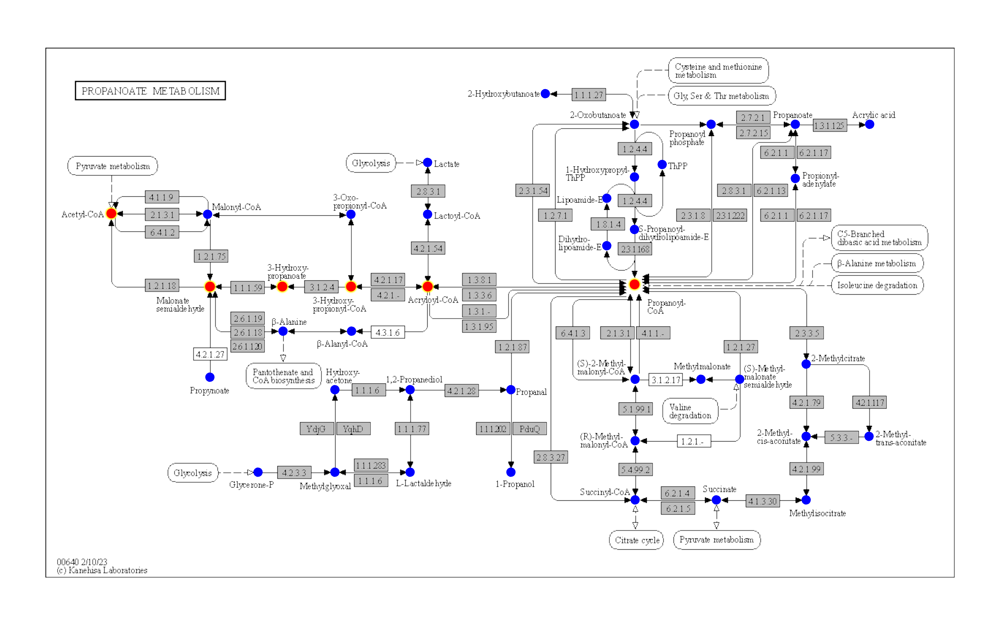
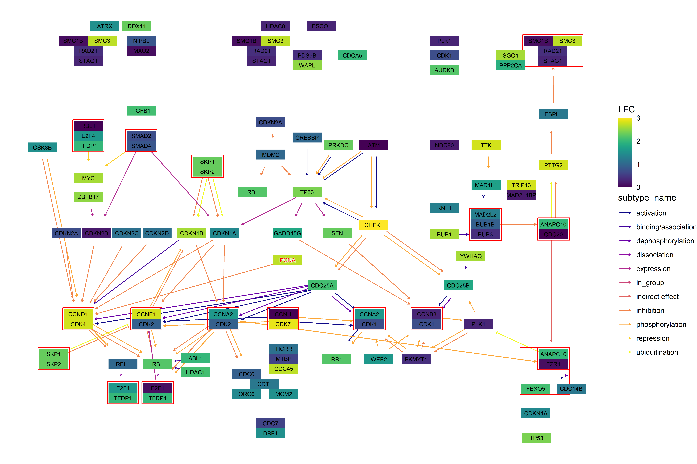
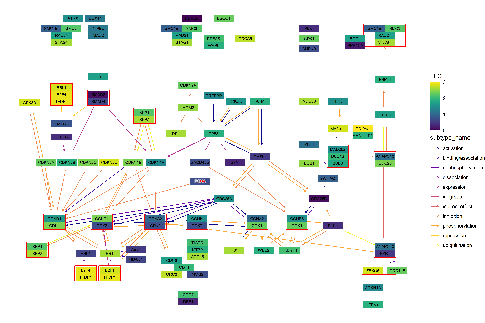

<!-- README.md is generated from README.Rmd. Please edit that file -->

# ggkegg

<!-- badges: start -->

[](https://github.com/noriakis/ggkegg/actions/workflows/R-CMD-check.yaml)
<!-- badges: end -->

A set of functions to analyse and plot the KEGG information using
`tidygraph`, `ggraph` and `ggplot2`.

The detailed documentation is
[here](https://noriakis.github.io/software/ggkegg) using `bookdown`.

## Installation

Using `BiocManager`:

``` r
BiocManager::install("ggkegg")
```

Using `devtools`:

``` r
devtools::install_github("noriakis/ggkegg")
```

## Examples

``` r
library(ggkegg)
library(ggfx)
library(igraph)
library(tidygraph)
library(dplyr)

pathway("ko01100") %>%
    process_line() %>%
    highlight_module(module("M00021")) %>%
    highlight_module(module("M00338")) %>%
    ggraph(x=x, y=y) +
        geom_node_point(size=1, aes(color=I(fgcolor),
            filter=fgcolor!="none" & type!="line")) +
        geom_edge_link0(width=0.1, aes(color=I(fgcolor),
            filter=type=="line"& fgcolor!="none")) +
        with_outer_glow(
            geom_edge_link0(width=1,
                aes(color=I(fgcolor),
                    filter=(M00021 | M00338))),
            colour="red", expand=5
        ) +
        with_outer_glow(
            geom_node_point(size=1.5,
                aes(color=I(fgcolor),
                    filter=(M00021 | M00338))),
            colour="red", expand=5
        ) +
        geom_node_text(size=2,
            aes(x=x, y=y,
                label=graphics_name,
                filter=name=="path:ko00270"),
            repel=TRUE, family="sans", bg.colour="white") +
        theme_void()
```



You can use your favorite geoms to annotate raw KEGG map combining the
functions.

``` r
compounds <- c("cpd:C00100", "cpd:C00894", "cpd:C00894", "cpd:C05668",
    "cpd:C05668", "cpd:C01013", "cpd:C01013", "cpd:C00222",
    "cpd:C00222", "cpd:C00024")
g <- pathway("ko00640") %>% mutate(mod=highlight_set_nodes(compounds, how="all"))
ggraph(g, layout="manual", x=x, y=y)+
    geom_node_rect(fill="grey",aes(filter=type == "ortholog"))+
    overlay_raw_map("ko00640")+
    geom_node_point(aes(filter=type == "compound"),
        shape=21, fill="blue", color="black", size=2)+
    ggfx::with_outer_glow(
        geom_node_point(aes(filter=mod, x=x, y=y), color="red",size=2),
        colour="yellow",expand=5
    )+
    theme_void()
```



Or customize graphics based on `ggraph`.

``` r
g <- pathway("hsa04110")
pseudo_lfc <- sample(seq(0,3,0.1), length(V(g)), replace=TRUE)
names(pseudo_lfc) <- V(g)$name

ggkegg("hsa04110",
    convert_org = c("pathway","hsa","ko"),
    numeric_attribute = pseudo_lfc)+
    geom_edge_parallel2(
        aes(color=subtype_name),
        arrow = arrow(length = unit(1, 'mm')), 
        start_cap = square(1, 'cm'),
        end_cap = square(1.5, 'cm')) + 
    geom_node_rect(aes(filter=.data$type == "group"),
        fill="transparent", color="red") +
    geom_node_rect(aes(fill=numeric_attribute,
        filter=.data$type == "gene")) +
    geom_node_text(aes(label=converted_name,
        filter=.data$type == "gene"),
        size=2.5,
        color="black") +
    with_outer_glow(
        geom_node_text(aes(label=converted_name,
            filter=converted_name=="PCNA"),
            size=2.5, color="red"),
        colour="white", expand=4
    ) +
    scale_edge_color_manual(values=viridis::plasma(11)) +
    scale_fill_viridis(name="LFC") +
    theme_void()
```


